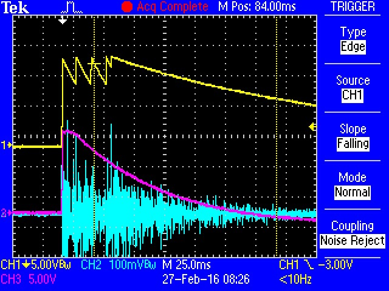
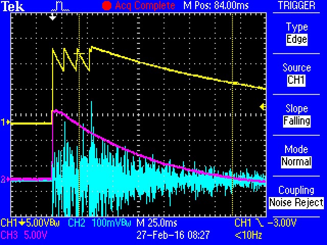

# Tama Techstar Handclap Analysis

Some captures of waveforms from the actual circuit, plus some analysis of what's going on.

Informed greatly by [schematics](http://fa.utfs.org/diy/tama305/Handclap.jpg) posted by Florian Anwander.

## Description of circuit

The circuit has two parallel paths.

The main clap is generated by the bottom path through the circuit.  The comparator stack of IC305 generates a series of shark fins when it's hit by the trigger.  Those shark fins are used to amplify tuned noise.

The "reverb" isn't really reverb, just a decaying noise burst.  It is generated by a second envelope, tuned by the `reverb time` pot.  The pot has a somewhat shallow range: it's a 100K in series with a 200K fixed resistor.

The `reverb level` pot mixes an adjustable level of reverb into the main clap signal.  The main clap level is fixed.

## Scope Captures

### No Reverb Applied

*Captured with the reverb mix control all the way down*

* Yellow trace is the comparator circuit output - 4 fins approx 10 mSec apart.
* Blue trace is output - bursts correspond to peaks in yellow trace.
* Purple trace is reverb env, unused in this capture.

Clap VCA is apparently biased such that it's on at the peaks of the shark fins, and off near their intersections,

#### Reverb Turned Up, Shortest Env

*Captured with the reverb mix control all the way up, Reverb Time All the way down.*

Timebase has been sommed outn one click - notice difference in peaks on yellow trace.

* Yellow is again the clap envelope.
* Blue is output.
* Purple is reverb envelope.

The output is the sum of the clap and reverb envs.  The individual splats of the claps are less obvious, since they're riding atop the reverb env.  

#### Reverb Turned Up, Longest Env

*Captured with the reverb mix control all the way up, Reverb Time All the way down.*

Timebase has been sommed outn one click - notice difference in peaks on yellow trace.

* Yellow is again the clap envelope.
* Blue is output.
* Purple is reverb envelope.

Purple isn't too significantly different, but it is indeed a bit longer.